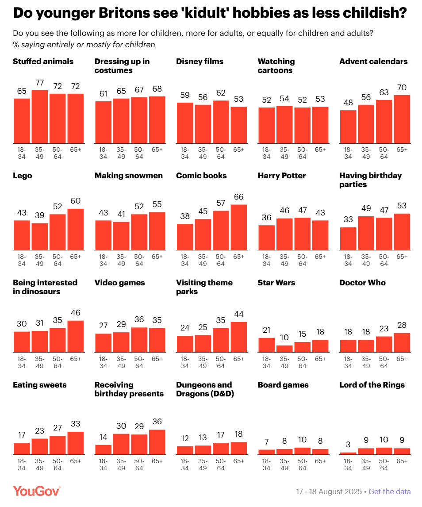
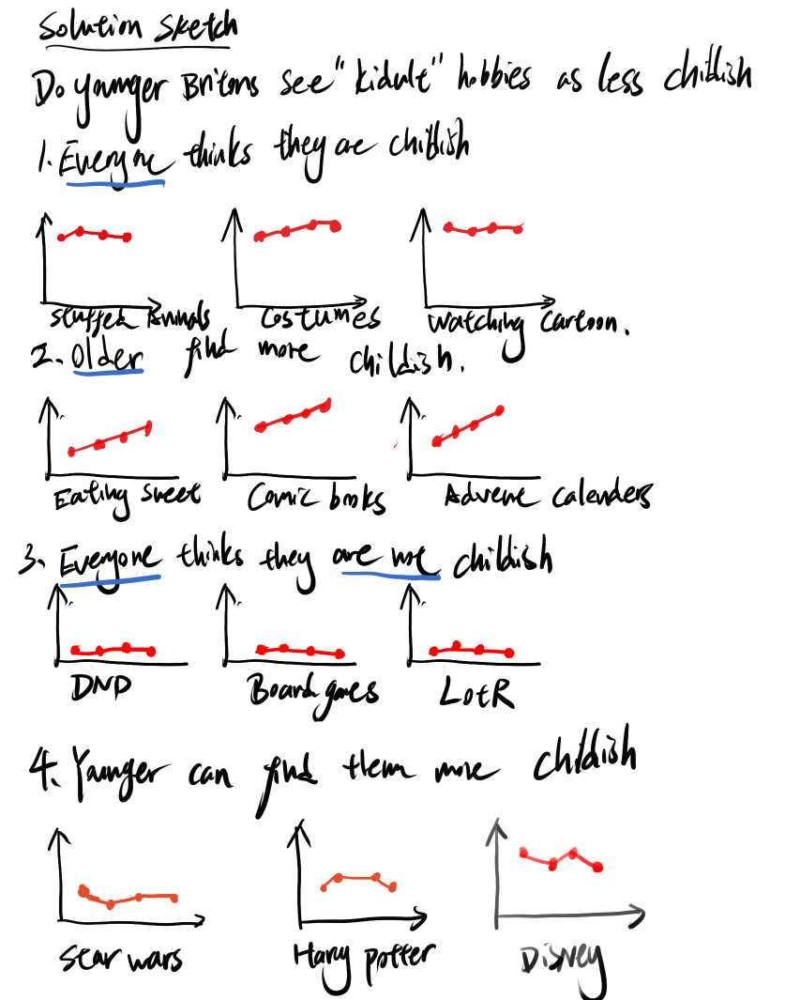

| [home page](https://zherenzh-source.github.io/zheren-dataviz-portfolio/) | [data viz examples](dataviz-examples) | [critique by design](critique-by-design) | [final project I](final-project-part-one) | [final project II](final-project-part-two) | [final project III](final-project-part-three) |

# Redesigning How Britons View “Kidult” Hobbies

## Step one: the visualization

[View the original visualization](https://makeovermonday.vercel.app/dataset/do-younger-britons-see-kidult-hobbies-as-less-childish)

I chose to redesign this chart because the visualization is supposed to show whether people of different **age demographics** see hobbies as childish. Different hobbies are shown as separate small multiple bar charts, with the percentage of people in different age groups viewing it as childish. I can see that the charts are organized so that the hobbies viewed as more childish are placed first, so the viewers can read it in some sort of order.

## Step two: the critique

However, while the colors are not distracting (only red and black), the fact that the same bar chart format is repeated 20 times made me a bit disoriented. I was not sure where to start looking with all of the charts looking so similar. Also, while the layout shows how childish each hobby is viewed overall, and it is easy for the viewer to see that The Lord of the Rings is clearly viewed as less childish than Harry Potter, I find it a bit hard to see the difference in opinions between different age groups. 

So, I want to try to break up the repeating chart format, in order to show where generational differences are large and where opinions are similar. My main idea is that the emphasis of charts should be focused more on the generation gap depending on the hobby. I would try grouping them by the patterns in their responses, like which hobbies show similar opinions across ages,  what cases show younger people viewing it as less childish, what cases show older people viewing it as less childish. 

I think **small multiple line charts** with the four age groups in the same order and a shared percentage scale could be good. This could make different patterns easier to recognize while keeping all four age groups visible. For example, cartoons and board games both have similar responses across age groups, but at very different percentage levels.

## Step three: Sketch a solution

I was trying to explore if grouping different patterns together would make the point stand out. Since the chart is intending to show the perspective difference between younger and older people. I decided to group the small multiple charts into 4 categories:

- All age groups tend to view these hobbies as childish
- All age groups tend not to view these hobbies as childish
- Younger people more likely to agree that these hobbies are childish
- Older people more likely to agree that these hobbies are childish

I also chose to change the chart type to lines, since that takes away the large areas of red bars in the original version, which makes it less distracting in my opinion.

## Step four: Test the solution

### Questions to ask

- Can you tell me what you think this is?

- Can you describe to me what this is telling you?

- Is there anything you find confusing?

- Is there anything you would change or do differently?
- 
### Results

| Feedback topic | Interview 1 | Interview 2 |
|  | Student(Arts Management) | Student(MISM) |
|---|---|---|
| Readability of the sketch | The hand-drawn sketch was not easy to read and needed an explanation. | Not recorded in the notes. |
| Small-multiple layout | The format was still a lot to take in at once. | The format was distracting. |
| Use of color | Not recorded in the notes. | Suggested assigning a color to each age group to emphasize the comparison. |

### Synthesis

Both viewers found the small-multiple format difficult to take in. This suggested that grouping the charts alone had not solved the main readability problem. The suggestion to assign a color to each age group led me to try a single chart with four colored lines. I still wanted to preserve all four age groups and compare patterns across hobbies, but I wanted to reduce the number of separate charts viewers had to scan.

## Step five: build the solution

### Revising the design: a multiple-line chart

<iframe src="https://public.tableau.com/views/Kidult_Line/Sheet12?:showVizHome=no&amp;:embed=true" title="Line chart trial" width="100%" height="850" style="border:0;"></iframe>

With the feedback received, I set out to revise the design. First of all, I still wanted to show the pattern comparison across different hobbies, so I thought a multiple-line graph comparing the views of different age groups across hobbies would be useful. The x-axis shows all the hobbies sorted in descending order of the overall percentage viewing them as entirely or mostly for children. The y-axis shows the percentage-point difference between each age group and the overall public. The overall percentage comes from the survey results, rather than a simple average of the four age groups. This way, we can see the difference in pattern on all the hobbies across age groups easily.

However, I felt that the line chart was still a bit hard to read. The crossing lines, crowded value labels, and vertical hobby names made the age-group differences harder to see at a glance, which is why I moved on to the final design.

### Final redesigned visualization

<iframe src="https://public.tableau.com/views/Kidult_Final/Sheet1?:showVizHome=no&amp;:embed=true" title="Final heatmap" width="100%" height="1000" style="border:0;"></iframe>

### Design decisions and reflection

For the final design, I switched to a heatmap to make the differences across age groups easier to see. Each row represents a hobby, and the four columns represent the age groups, ordered from youngest to oldest. I kept the hobbies sorted in descending order of the overall percentage viewing them as entirely or mostly for children. This allows viewers to compare age groups within each hobby and scan down each column to identify broader patterns.

Instead of using color to identify age groups, I used it to show whether each group was more or less likely than the overall public to consider a hobby childish. Orange indicates a lower percentage, blue indicates a higher percentage, and darker colors indicate larger differences. The numbers inside the cells show the same percentage-point differences as the colors, so the two encodings are consistent. I also added an Overall column beside the hobby names to show the baseline for each comparison and make the descending order clear.

Compared with the line chart, the heatmap makes it easier to see that younger adults generally fall below the overall percentage, while older adults generally fall above it. It also makes exceptions easier to spot, such as Disney films, where the youngest group is above the overall percentage and the oldest group is below it. By removing crossing lines and placing the hobby names horizontally, I wanted viewers to spend less time tracing individual values and more time comparing the age-group patterns.

## References

- Original visualization: [Makeover Monday](https://makeovermonday.vercel.app/dataset/do-younger-britons-see-kidult-hobbies-as-less-childish)
- Survey data: YouGov, *Internal_Kidulting_250818.pdf*, fieldwork 17–18 August 2025.
- Visualization tool: Tableau.

## AI acknowledgements

I used Copilot to brainstorm the topic, explore design alternatives, and understand Tableau calculations. I also used it to embed the charts properly.

