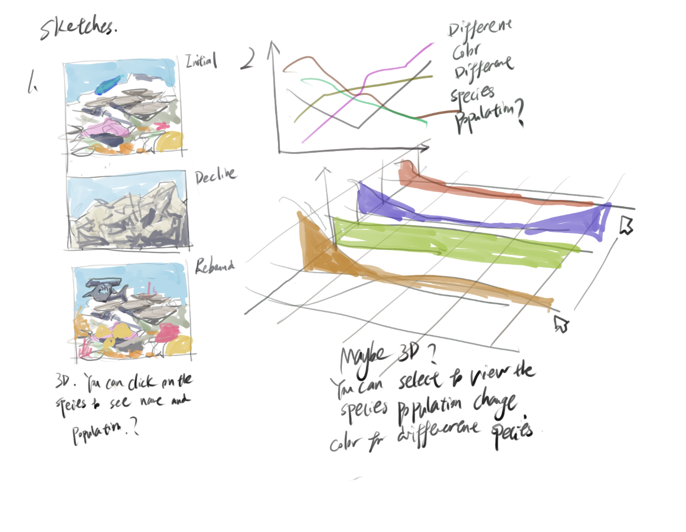

| [home page](https://cmustudent.github.io/tswd-portfolio-templates/) | [data viz examples](dataviz-examples) | [critique by design](critique-by-design) | [final project I](final-project-part-one) | [final project II](final-project-part-two) | [final project III](final-project-part-three) |

> Important note: this template includes major elements of Part I, but the instructions on Canvas are the authoritative source.  Make sure to read through the assignment page and review the rubric to confirm you have everything you need before submitting.  When done, delete these instructions before submitting.

# Outline

In this porject, I want to explore what the current variaty and stability is for marine ecosystem. For example, did the ocean suffer any great ecological impact due to global warming, contamination or other factors? 

After that, when searching for potential data, I found annual coral-cover observations at two monitored sites on the north shore of Moorea, French Polynesia. Both sites experienced a steep decline in coral cover, followed by growth that surpassed their 2005 levels. I then want to ask two questions: what kinds of coral accounted for that growth, and what happened when monitoring continued?

The story will compare total coral cover with the share of that cover occupied by a specific coral genus Pocillopora( referred to as poc from now on). My preliminary calculations show that Poc accounted for a larger share in 2018 than in 2005 at both sites. Extending the record through 2021 also reveals another large decline in total cover.

Furthermore, more data of species in the surrounding area could be incorporated to flesh out the story. Is the overall biosphere changing post-rebound ver pre-decline.
## Project structure and story arc

1. A simple introduction the 2 coral sites. A graphic of the coral site, so the point is clear. We are talking about reefs here.
2. Show the loss and the return. A line chart, shows annual mean total coral cover for each site on the same 0–100% scale.
3 Extend the observation period. The line chart continues through 2021. This could show how different or similar the recovered environment is.

## Initial sketches
> Post images of your anticipated data visualizations (sketches are fine). They should mimic aspects of your outline, and include elements of your story.  

# The data
> A couple of paragraphs that document your data source(s), and an explanation of how you plan on using your data. 

The primary source is the public [BCO-DMO coral-cover dataset, version 1](https://www.bco-dmo.org/dataset/918265), published by Edmunds, Burgess, and Maritorena in 2024 under a [CC BY 4.0 license](https://creativecommons.org/licenses/by/4.0/). It is derived from Moorea Coral Reef LTER monitoring. The sampling design uses approximately 40 fixed photoquadrat positions along a permanent 50 m transect at each site, with 200 annotated points per photograph. The source's total-coral category includes scleractinians and *Millepora*.

I have obtained and inspected the working CSV needed for every core chart. It contains **1,312 observations, two sites, one depth of 10 m, and 17 years from 2005 through 2021**. The public title and temporal-extent field say 2008–2021, but the downloadable file includes 2005–2007; this proposal uses the years actually present in that file and records the discrepancy. The source study emphasizes 2008–2021. The two cover columns support a comparison of one genus with all remaining recorded corals; they do not provide a full taxonomic inventory.
| Working material | Access | Use |
| --- | --- | --- |
| Source data and metadata | [Dataset page](https://www.bco-dmo.org/dataset/918265) · [Persistent DOI](https://doi.org/10.26008/1912/bco-dmo.918265.1) | Definitions, sampling methods, provenance, and citation. |
| Unchanged source CSV | [Public download](https://datadocs.bco-dmo.org/dataset/918265/file/5A0J6pVhZ6gzrz/918265_v1_coral-cover.csv) · [Included working copy](data/918265_v1_coral-cover.csv) | Photoquadrat observations for all project calculations. |
| Annual summary | [Project CSV](data/moorea_annual_summary.csv) | 34 site-year records, ready to import into Tableau. |
| Processing documentation | [Data notes](data/README.md) · [Calculation script](tools/prepare_moorea.py) · [Validation record](data/data_validation.json) | Reproduce the summary and inspect checks and definitions. |

# Method and medium
I plan to build a standalone scrolling story in **Shorthand**, with interactive charts created in **Tableau Public** and embedded alongside the narrative. The included script prepares the CSV; Tableau will handle chart interactions and tooltips. Each scene will present a specific question and interpretation, with limited controls that support comparisons between years, sites, and measures.

My GitHub portfolio will document the proposal, data, sketches, and later revisions, and link to the finished story. I will use direct labels, distinct marker shapes, readable contrast, descriptive captions, and text equivalents of key findings. I will check the embedded charts on desktop and mobile and retain static fallbacks. The final presentation will end with its conclusion and sources, so it can be understood independently of this proposal.

## References
- Edmunds, P. J., Burgess, S., & Maritorena, S. (2024). *Percentage cover of the benthos by live coral at 10 m depth at sites in Moorea Moorea, French Polynesia from 2008 to 2021*. BCO-DMO, version 1, 2024-01-23. [https://doi.org/10.26008/1912/bco-dmo.918265.1](https://doi.org/10.26008/1912/bco-dmo.918265.1). Accessed September 24, 2026. The duplicated “Moorea” is retained from the source title.
- Moorea Coral Reef LTER & Edmunds, P. (2024). *MCR LTER: Coral Reef: Long-term Population and Community Dynamics: Corals, ongoing since 2005*. Environmental Data Initiative. [https://doi.org/10.6073/pasta/15d5120fb4f7b79811b16287eae15a35](https://doi.org/10.6073/pasta/15d5120fb4f7b79811b16287eae15a35). Original monitoring source identified by BCO-DMO; calculations here use the BCO-DMO release above.
- Edmunds, P. J., Maritorena, S., & Burgess, S. C. (2024). Early post-settlement events, rather than settlement, drive recruitment and coral recovery at Moorea, French Polynesia. *Oecologia, 204*, 625–640. [https://doi.org/10.1007/s00442-024-05517-y](https://doi.org/10.1007/s00442-024-05517-y). Related research for ecological context; this proposal does not replicate its recruitment models.

## AI acknowledgements
I used chatgpt to explore the topic, and brainstorm, as well help with citation.
