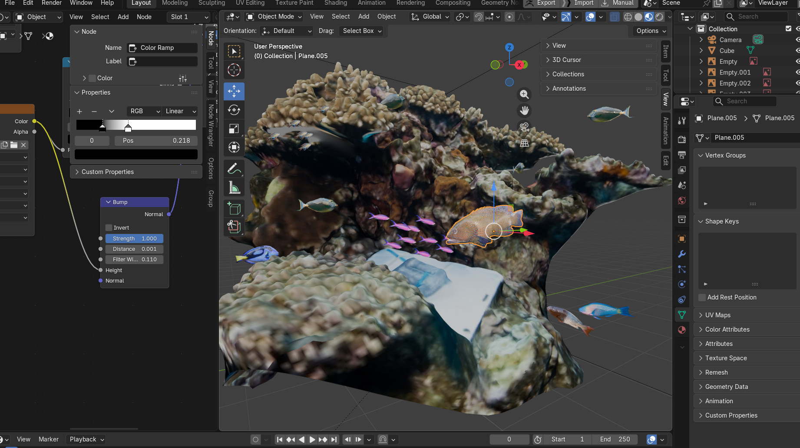

| [home page](https://zherenzh-source.github.io/zheren-dataviz-portfolio/) | [data viz examples](dataviz-examples) | [critique by design](critique-by-design) | [final project I](final-project-part-one) | [final project II](final-project-part-two) | [final project III](final-project-part-three) |

# Wireframes / storyboards
My project follows changes in living coral cover and reef fish at two monitoring sites on the northern coast of Moorea, French Polynesia. The central question is whether the substantial recovery after the first period of coral loss was repeated after the 2019 bleaching event.
Since Part I, I have developed five Tableau worksheets and begun assembling the narrative in Shorthand. The draft moves from the overall coral-cover record to coral composition, then examines fish density and feeding groups. The charts provide the clear intuitive evidence. The story here is how the coral ecosystem is a delicate beauty that has impact on a whole lot of creatures, and how alarming the decline is again after recovery since 2019.

Shorthand here:
https://carnegiemellon.shorthandstories.com/can-a-coral-reef-recover-twice/index.html

I intend to run the story like this:

1. Opening	

2. Following two reefs in Moorea
   
<h3>Coral cover</h3>

<iframe
  src="https://public.tableau.com/views/coral_17909009830940/Coral?:showVizHome=no&amp;:embed=true&amp;:tabs=no&amp;:toolbar=yes"
  title="Coral cover, 2006–2025"
  style="width: 100%; height: 600px; border: 0;"
  allowfullscreen>
</iframe>

3. What came back?	
<h3>Coral composition</h3>

<iframe
  src="https://public.tableau.com/views/coralcomposition/Coralcomposition?:showVizHome=no&amp;:embed=true&amp;:tabs=no&amp;:toolbar=yes"
  title="Coral composition, 2006–2025"
  style="width: 100%; height: 600px; border: 0;"
  allowfullscreen>
</iframe>
4. What happened to the fish in the ecosystem?	

<h3>Fish density</h3>

<iframe
  src="https://public.tableau.com/shared/6XR7DHBJJ?:showVizHome=no&amp;:embed=true&amp;:tabs=no&amp;:toolbar=yes"
  title="Fish density, 2006–2024"
  style="width: 100%; height: 600px; border: 0;"
  allowfullscreen>
</iframe>
5. Then What changed in the fish community?	
<h3>Fish trophic groups</h3>

<iframe
  src="https://public.tableau.com/views/Fishtrophicgroups/Fishtrophicgroups?:showVizHome=no&amp;:embed=true&amp;:tabs=no&amp;:toolbar=yes"
  title="Fish trophic groups, 2006–2024"
  style="width: 100%; height: 800px; border: 0;"
  allowfullscreen>
</iframe>
6. Why has recovery been slower this time?

The 3D demo scenes are still in development:

# User research 

## Target audience
The intended audience is general readers, including university students interested in the environment who have limited or some knowledge of coral reefs. They may know that bleaching damages coral without knowing how living coral cover differs from the physical reef structure, or how different fish groups use reef resources. 

## Interview script
> List the goals from your research, and the questions you intend to ask. 

Text here!

| Goal | Questions to Ask |
|------|------------------|
| Understand the main message     |        In your own words, what is this story about? Can you tell immediately?       |
|    Check chart interpretation  |        Look at this coral chart(or other charts), what do you see, which years or event stands out?          |
|   Evaluate fish charts   |          How did fish density change? What differences do you notice between the feeding groups?        |
|Identify confusing or missing elements|  What part confused you, or do you think there is anything to be improved? |

## Interview findings

| Questions               | MISM student | Arts Management student | ETC Game Design student  |
|-------------------------|--------------------------------|-------------|-------------|
| Question you asked here | Insightful feedback            |   ...          |       ...      |
|     What part confused you, or do you think there is anything to be improved?                     | Interesting. But feels like the story element can be stronger if added more explanation to why this is happening.  Maybe related study?               |   Mentions that if the different species of fishes are also shown, people who are less interested in marine biology might be more engaged.          |   Agrees that the ending needs more conclusion, right now it is more like a survey than a story.          |

# Identified changes for Part III
> Document the changes you plan on implementing next week to address any issues identified.  

| Research synthesis | Anticipated changes for Part III |
|---|---|
| More explanation of why these changes occurred. | Add context around the major disturbances and delayed recovery of the coral reef. In particular, explain how dead coral skeletons remaining after the 2019 bleaching event may affect new coral growth, and link to the supporting study. |
| Showing more different fish species | Add representative fish images or 3D models with common names and short descriptions of their feeding roles. Also could incorporate them with the trophic group chart, so people see what fishes each trophic group are|
| The ending needed a stronger conclusion | Revise the ending to directly address the opening question, “Can a coral reef recover twice?” Emphasize that the first recovery demonstrates what is possible. Shown how brittle the beautiful ecossystem is, and how to protect it. |

My priority for Part III is to make the significance of the data easier to understand. Also, completing the interactive 3d demo scene.

## References

- Moorea Coral Reef LTER coral-cover dataset, package **knb-lter-mcr.4.44**.
- Moorea Coral Reef LTER fish-survey dataset, package **knb-lter-mcr.6.65**, including `MCR_LTER_Annual_Fish_Survey_20260304.csv`.
- [Moorea Coral Reef LTER](https://mcr.lternet.edu/), for project background and dataset access. [ADD THE EXACT DATASET LANDING-PAGE LINKS USED IN PART I.]
- Scafidi, K. C., et al. (2026). [Remnant hollowed out dead coral skeleton branches defer coral community recovery](https://doi.org/10.1371/journal.pone.0339527). *PLOS ONE*, 21(3), e0339527.
- [ADD CREDITS AND LICENCES FOR ANY PHOTOGRAPHS, MODELS, OR TEXTURES ACTUALLY INCLUDED.]

## AI acknowledgements
I used Copilot to help explore and check the datasets, work through Tableau calculations, and working with shorthand. I also used ChatGPT to help with my 3d scene creation.

